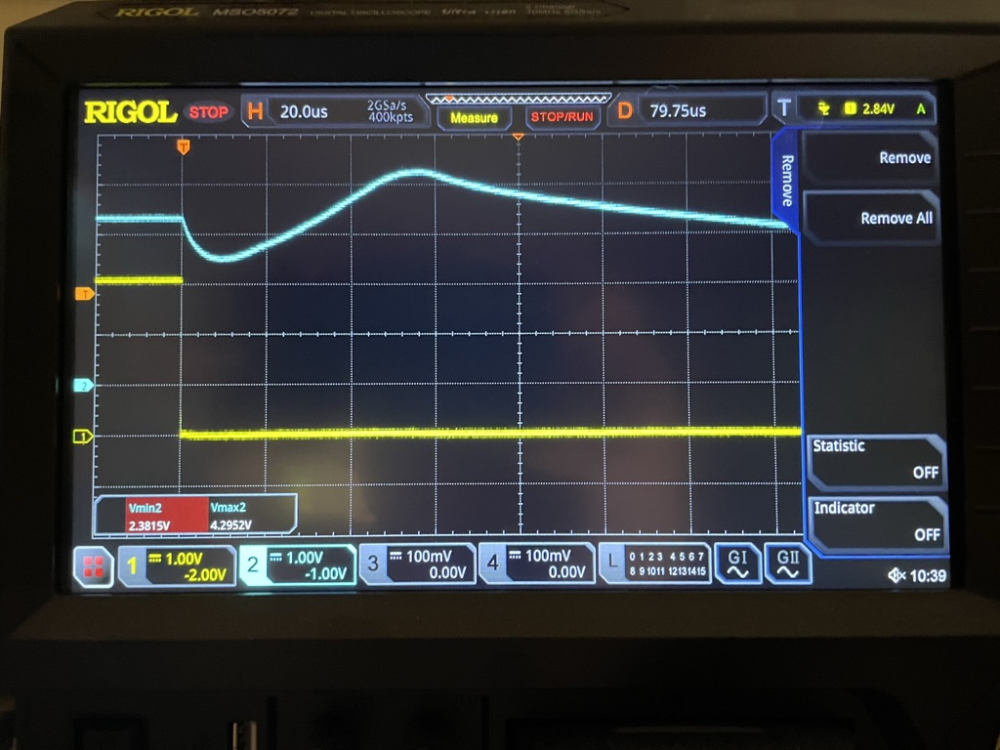

# Stable Release V1.8.3

```{post} September 16, 2023
:author: esden
```

We are happy to announce the [V1.8.3 bugfix point release](https://github.com/blackmagic-debug/blackmagic/releases/tag/v1.8.3) of [Black Magic Debug](https://black-magic.org).

## In this release

- Fixed an issue with the fake threads implementation that can hang certain IDEs [dragonmux]
- Soft TPWR ON: Mitigates target power enable brownout issue on v2.3 hardware [dragonmux] [esden]

Note: The brownout mitigation was also implemented for all older native hardware versions. Read below for more information.

We had reports from some users that the V2.3 hardware was resetting/crashing when the user enabled target power using the `monitor tpwr enable` command. During the investigation it turned out that the BMP was browning out. The GD32 found on the V2.3 hardware has higher minumum voltage requirement than the STM32. This means it will brown out more likely if the 3.3v rail dips. The solution to this problem was to slowly turn on the target power using PWM instead of instantly turning it on.

We also tested the solution on older hardware versions that use the STM32. Those were also experiencing a significant voltage drop. Additionally after the voltage drops the rail voltage overshoots by a significant amount. Because the overshoot we decided that it is a significant issue, as it can have adverse effects on the connected user targets. We decided to backport this fix to older firmware releases (1.8 & 1.9) as well as older hardware (all native hardware versions except for hardware version 0 as it does not have TPWR control).

To illustrate the problem and solution here are some oscilloscope traces:

HW4 without Soft TWPR ON:


HW4 with Soft TPWR  ON:


## Contributors to v1.8.3

We have had 1 individual contribute 5 commits since the v1.8.2 release.

Contributor (Contributions)  
dragonmux (5)

## Sponsors

This project is sponsored in parts by:

- [1BitSquared](https://1bitsquared.com/) - Design, Manufacture and distribution of open source embedded hardware development tools and platforms, as well as educational electronics. Thank you everyone who buys Black Magic Probes from 1BitSquared directly through our [stores](https://1bitsquared.com/products/black-magic-probe) or indirectly through [Adafruit](https://www.adafruit.com/product/3839). The hardware sales allow us to continue supporting the [Black Magic Debug](https://black-magic.org) project.
- All the generous [Patrons](https://www.patreon.com/1bitsquared) and [GitHub Sponsors](https://github.com/sponsors/esden) supporting esden’s work
- All the generous [GitHub Sponsors](https://github.com/sponsors/dragonmux) supporting dragonmux’s work
