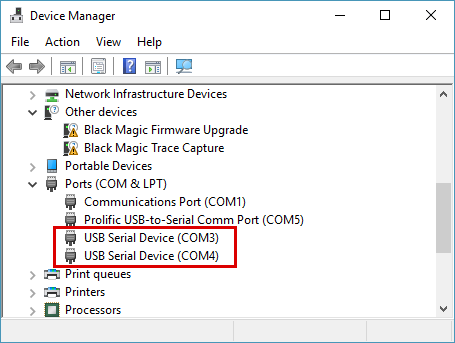

# Getting Started

## Get a Black Magic Probe

If you don't have one already, you'll need to [get a Black Magic Probe](index.md#getting-hardware).

## Connecting to your computer

Connect the Black Magic Probe to your computer's USB port. When connected via USB, the Black Magic Probe will
enumerate as, among other bits, a pair of CDC-ACM (USB serial) devices.

On Linux, the OS should present these as `ttyACM` devices. On macOS they should be presented as pairs of `tty.`
and `cu.` devices, and on Windows they should be presented as a pair of COM ports.

On Linux you can check the kernel log to find the device that was allocated:

```sh
user@host ~ $ sudo dmesg
[460705.378940] usb 7-5: new full-speed USB device number 24 using ohci-pci
[460705.594118] usb 7-5: New USB device found, idVendor=1d50, idProduct=6018, bcdDevice= 2.00
[460705.594131] usb 7-5: New USB device strings: Mfr=1, Product=2, SerialNumber=3
[460705.594137] usb 7-5: Product: Black Magic Probe v2.0.0
[460705.594142] usb 7-5: Manufacturer: Black Magic Debug
[460705.594146] usb 7-5: SerialNumber: 8BB20695
[460705.600355] cdc_acm 7-5:1.0: ttyACM0: USB ACM device
[460705.604234] cdc_acm 7-5:1.2: ttyACM1: USB ACM device
```

The first interface provides the GDB server, and the second provides a USB to UART adapter.

```{note}
On Linux, this guide assumes you have installed the
[udev rules file](https://github.com/blackmagic-debug/blackmagic/tree/main/driver)
for your distribution from the repository.
```

On Windows, when you first connect, the Black Magic Probe should be detected as two COM ports. The first COM
port is the GDB extended remote server and the second one is USB to Serial adapter on the back of the board.
To find the allocated ports, check the Device Manager:


```{note}
For older Windows versions (Windows 7 and older), you will be prompted to install a driver. You can download
the [driver .inf](https://github.com/blackmagic-debug/blackmagic/tree/main/driver) from the repository.
```

```{note}
If you are on Windows 10 and want to upgrade the firmware to the probe itself, you can install the
[WinUSB driver via Zadig](https://zadig.akeo.ie/). This will give you access to the DFU interface of the
Black Magic Probe and allow you to use dfu-util to upgrade the Black Magic Probe firmware. (You do not need
to install this driver if you only plan to use the Black Magic Probe and do not need/want to upgrade the
firmware.) Windows 10 displays the BMP probe ports using the generic title, "USB Serial Device", as seen below:


```

## Connecting to the software

To use the Black Magic Probe, you will need an ARM cross toolchain for developing and debugging embedded ARM
Cortex applications on your computer. The
[gcc-arm-embedded](https://developer.arm.com/downloads/-/arm-gnu-toolchain-downloads) toolchain is recommended.
The toolchain will include the GNU Debugger, GDB, for debugging ARM applications.

```sh
user@host ~ $ arm-none-eabi-gdb
GNU gdb (GNU Tools for ARM Embedded Processors) 7.6.0.20140228-cvs
Copyright (C) 2013 Free Software Foundation, Inc.
License GPLv3+: GNU GPL version 3 or later <http://gnu.org/licenses/gpl.html>
This is free software: you are free to change and redistribute it.
There is NO WARRANTY, to the extent permitted by law.  Type "show copying"
and "show warranty" for details.
This GDB was configured as "--host=i686-linux-gnu --target=arm-none-eabi".
For bug reporting instructions, please see:
<http://www.gnu.org/software/gdb/bugs/>.
(gdb)
```

The GDB remote debugging protocol is implemented over the Black Magic Probe's CDC-ACM interface. To connect
your ARM GDB to the target device use the following commands:

```gdb
(gdb) target extended-remote /dev/ttyBmpGdb
Remote debugging using /dev/ttyBmpGdb
(gdb) monitor jtag_scan
Target voltage: 3.4V
Device  IR Len  IDCODE      Description
0       4       0x4BA00477  ARM Limited: ADIv5 JTAG-DP port.
1       5       0x06413041  ST Microelectronics: STM32F4xx.

Available Targets:
No. Att Driver
 1      STM32F4xx

(gdb) attach 1
Attaching to Remote target
0x080071b2 in ?? ()
```

The command `monitor swdp_scan` may be used to use the Serial-Wire Debug Protocol instead of JTAG to connect
to the target.

Once attached, all the standard GDB commands may be used to start and control
the execution of the embedded application. [GDB Commands](usage/gdb-commands.md) provides a quick introduction.

```{note}
On macOS use the `/dev/cu.usbmodem<somenumber>`. Don't use the tty version of this device as this one will
freeze gdb when it tries to open it.
```

```{note}
By default, VCC is not enabled on either UART or JTAG/SWD, to prevent conflicts between multiple power sources.
To enable the probe as a power source, you must use the `monitor tpwr enable` gdb command.
```

On Windows, use the the COM port instead of `/dev/ttyBmpGdb`. For ports COM10 and higher, add the prefix `\\.\`,
for example:

```gdb
target extended-remote COM3
target extended-remote \\.\COM10
```

```{note}
It is safe to always use the `\\.\` prefix even for ports lower than COM10. So when you are writing scripts you
can just always prefix the COM port number.
```

## Video Tutorial

Esden created a video walk-through of using Black Magic Probe with the 1Bitsy microcontroller board on Linux.

```{youtube} ANM0fdAqDow
```

If you have additional tutorial resources for the use of Black Magic Probe let us know so we can include them here.

## Getting started with open-source Cortex-M development

- See [this presentation](https://github.com/gsmcmullin/embedded-demo/raw/master/slides.pdf), porting a basic
  Unix program to an embedded Cortex-M3 using [libopencm3](http://libopencm3.org/).
- The [gcc-arm-embedded readme](https://launchpadlibrarian.net/268329726/readme.txt) is also worth a read.
