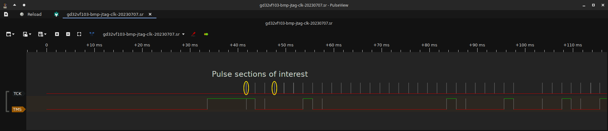
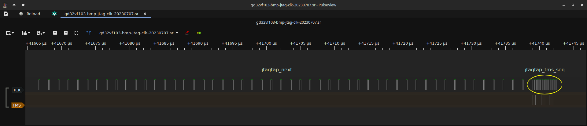
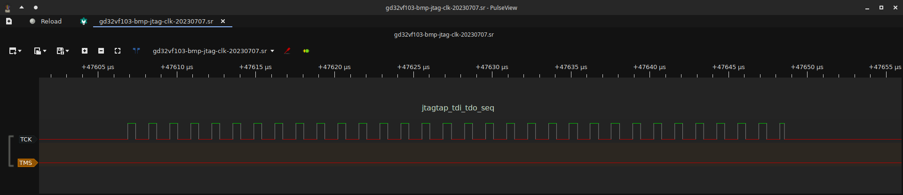

# Target Clock Generation

The Black Magic Debug firmware generates a clock signal to the debug target for both JTAG and SWD
by bitbanging, timed to the other signals involved in ths bus to generate transactions and exchange
data. The bitbanging routines are not perfect at this and so generate a signal with
an odd mark-to-space ratio and at different frequencies depending on which routine is in play.

Due to all of the above, this winds up requiring a very particular approach for measuring the
clock frequency generated to produce a number to report to the user, to take clock speed requests
and map them to delay loop iteration counts, internally called the *clock divider*, and then represent them
in the firmware.

The aim of this page is to lay out the method used to derive these clock frequency numbers and the
analytical tools used to then generate a calibration for a platform's `platform.h` header to make the
reporting and interaction as usefully accurate as possible.

This method comes with a [LibreOffice workbook](../_assets/target-clk-gen/BMP_Frequency_Division.ods)
that acts as a tool for calculating the offset and division factors for computing `target_clk_divider`
in the firmware, which should be used to gather the measurements and verify results.

## Measurement

In measuring TCK, because of how the bitbanging routines are written and work, it is assumed that
we are also deriving a reasonably accurate measurement for SWCLK - within 10kHz or so for a MHz range
clock speed measurement. Further, because of how the JTAG routines work, we must measure 3 key routines'
clock frequencies to come to a typical/average clock frequency, especially as these are the most common
3 routines that get called. They are, from the `jtag_proc` structure, `jtagtap_next()`, `jtagtap_tms_seq()` and
`jtagtap_tdi_tdo_seq()`.

### The methodology

To make measurements, one will need a logic analyser capable of at least a 24MHz capture such as the
BitMagic Basic. We start out with firmware compiled for the target probe that has, by modifying the remote
protocol implementation, been forced to use the `_no_delay` bitbanging routines and a matching BMDA with
which to run JTAG scans of a suitable target. Within this section we will be using the BitMagic Basic
logic analyser and PulseView to make measurements, and have just two lines of the JTAG bus tapped - TCK and TMS.

TMS is used to help navigate the capture and find the correct routines to measure, TCK is of course the
signal we want to measure. We use a 1% pre-trigger capture ratio, 24MHz sampling frequency and 100 million
samples per capture to ensure we get sufficient data.

To prepare the first (`_no_delay`) run, we co-opt the remote protocol by {bmd-gh}`editing remote.c<blob/799a4088e6c98fcbd977d9c3f2036bef4ba1e9b6/src/remote.c#L272>`.
We do this by commenting out the referenced line and replacing it with `target_clk_divider = UINT32_MAX;`
which, by virtue of how the bitbanging routines are written, forces the _no_delay variants.

We then load the firmware onto the probe, arm the logic analyser capture, and run BMDA as
`src/blackmagic -tjv 1`. This will perform a JTAG scan, which prints the results and then exits.
Once complete, we can then turn our attention to PulseView where you should see a capture like the following:

### Why these sections

The resulting capture has, as noted, two regions of interest. The reason for this is that they contain
clock pulses from all 3 major routines used and are easily identified. This is why we capture TMS as well.

At the start of a JTAG scan run, BMD {bmd-gh}`reinitialises its JTAG subsystem<blob/799a4088e6c98fcbd977d9c3f2036bef4ba1e9b6/src/target/jtag_scan.c#L89-L96>`.
When it does this, it sets TMS high, sets the jtag_proc structure back up, and then [runs a >50 pulse JTAG
reset and the ARM SWD-to-JTAG sequence](https://github.com/blackmagic-debug/blackmagic/blob/799a4088e6c98fcbd977d9c3f2036bef4ba1e9b6/src/platforms/common/jtagtap.c#L53-L55).

This then ensures the bus is in a good state while leaving TMS high after. We then perform an additional
JTAG reset when starting the ID code readout, along with having to switch into the Shift-DR JTAG TAP state. These
are the additional sets of pulses between the marked ones of interest. We finally do
{bmd-gh}`several 32-bit transactions<blob/799a4088e6c98fcbd977d9c3f2036bef4ba1e9b6/src/target/jtag_scan.c#L171>`
on the bus, with the goal of reading out ID codes. These are done with TMS low giving this distinctive signature
between TMS and TCK that we see in the capture.

### Making the measurements

We make multiple measurements in each of the following steps due to jitter caused by the capture's
temporal resolution resulting in quantisation noise. That is, if we measure only one cycle, the value measured
may be off by a substantial enough factor that it introduces excessive error into subsequent calculations.
We counter that by making several measurements of each section of pulses, and then applying a standard average
to compensate for the capture's jitter.

We start by zooming in on the first pulse section of interest, and then using measurement markers to make
several (at least 10) single-period measurements of the clock pulses generated by `jtagtap_next()`, making
notes of the results and how many of each value are observed. Add the result up and divide by the total number
of samples taken. Record the final result for later use.

We then repeat for `jtagtap_tms_seq()`, making a record of the final result using the same multiple measurement
and averaging method.

Finally, we zoom back out, pan over and then zoomed back in on the second section of interest. We then repeat
the measurement protocol on this final set of pulses and make a record of the final result after averaging.

### Deducing the final TCK clock frequency

After following the measurement protocol outlined above, you will now have 3 values - a clock frequency achieved
by `jtagtap_next()`, `jtagtap_tms_seq()`, and `jtagtap_tdi_tdo_seq()`.

It is tempting to take the fastest of these and say "that's the clock frequency!", but this would be misleading
to the user and especially when trying to make comparative measurements to other probes and the clock frequencies
they achieve. So instead, for comparative accuracy, we must average between these 3 measurements.

Simply adding the 3 values up and dividing by 3 provides a reasonable approximation of the achieved clock frequency
for BMP. With this done, using the workbook referenced in the introduction, note the final value in column
A of the workbook against the delay factor line you have measured.

### Additional measurements

After following this guide to get a measurement of the `_no_delay` routines, which will act as a baseline for
the highest achievable frequency output, we must then repeat with `target_clk_divider` set to the values
0 through 4 (for 5 sets of additional measurements to the `_no_delay` one).

These additional measurements provide the data required to perform a linear regression, and set the representation
baseline for the divider calculation.

## Linear Regression

Having completed the measurement protocol a total of 6 times, the workbook will compute the period (in seconds) of
the clock frequencies measured, offset those against the baseline divider measurement (`target_clk_divider = 0`),
and perform a linear regression on the results to generate a division factor. It will also calculate an offset
factor, in cell B12 of the sheet "Data", which serves to determine how much the division factor must be offset to make
the calculations all work.

The firmware runs the linear equation `divider = (clk_divider + div_factor) * offset` and its rearrangement for
`clk_divider` to map between `target_clk_divider` and frequency values as accurately as it reasonably can.
`divider` in these equations is the value the CPU clock frequency is divided by, in order to map to the intended
TCK clock frequency.

It is important that the CPU frequency value in cell A9 of the sheet "Data" is accurate and is expressed in Hz.

The final division factor is provided as an output in cell B9 of the sheet "Data".

## Writing the calibration for the platform

Having done all of the above, there are a series of simple `#define` statements that must be added to the platform's header. We will make reference to the native (BMP) platform as an example for this section.

The first thing that must be defined in the platform header, is {bmd-gh}``BITBANG_CALIBRATED_FREQS`<blob/799a4088e6c98fcbd977d9c3f2036bef4ba1e9b6/src/platforms/native/platform.h#L296>`
which serves to inform the `platform_max_frequency_{get,set}` implementations that a calibration has been done and
not to use the old method this replaces.

With this defined, we must then define the frequency achieved by the `_no_delay` routines, and the maximum frequency
achieved by  the `_clk_delay` routines. This involves defining {bmd-gh}`BITBANG_NO_DELAY_FREQ and BITBANG_0_DELAY_FREQ<blob/799a4088e6c98fcbd977d9c3f2036bef4ba1e9b6/src/platforms/native/platform.h#L305-L313C9>`
which are the measured frequency values expressed in Hz.

Finally, the conversion constants for the delay routines must be defined. These are
{bmd-gh}`BITBANG_DIVIDER_OFFSET and BITBANG_DIVIDER_FACTOR<blob/799a4088e6c98fcbd977d9c3f2036bef4ba1e9b6/src/platforms/native/platform.h#L327-L328>`.
These are the values from the linear regression called out in the above section -
workbook sheet "Data", cells B9 and B12.
