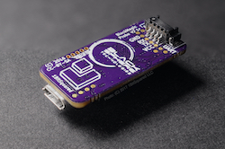
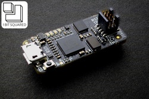
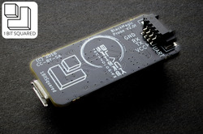

# Supported Hardware

Black Magic Probe firmware can be compiled for many different target platforms. Here is a short list with descriptions of different targets.

## Native Hardware

The following is a list of official hardware supported by the native target that is the default compilation target of Black Magic Probe firmware.  All revisions of the native hardware work with the same firmware binary.

### Black Magic Probe V2.3 (BMP23)


**Status** Active

**Source** [Vendors](index.md#getting-hardware)

**Schematic** TODO

New, slightly larger form factor than previous versions to accommodate the larger TQFP MCU package, AUX connector and additional flash chip. Following is a list of the main differences to the predecessor relevant to an end user.

* Added jumpers allowing the connection of the UART TX/RX pins to the JTAG/SWD connector resulting in a "unified debug" connector
* TraceSWO UART, decoding hardware support added (firmware support pending)
* Added 16 MByte on board flash (firmware support pending)
* AUX connector for accessories (firmware support pending)
* Mechanical layout allowing easier use of enclosures and mounting into bigger systems. For example: automated pogopin test equipment, automated Hardware In The Loop (HITL) Continuous Integration (CI) systems
* Improved layout, allowing further improvement of the Black Magic Debug firmware reliability and speed using hardware protocol acceleration (firmware support pending)
* Uses a USB-C connector instead of Micro USB-B

### Black Magic Probe Mini V2.1 (BMP21)




**Status** Legacy (not in production)

**Source** [Vendors](index.md#getting-hardware)

**Schematic** [bmpm_v2_1c_schematic.pdf](_assets/bmpm_v2_1c_schematic.pdf)
**Schematic** [bmpm_v2_1e_schematic.pdf](_assets/bmpm_v2_1e_schematic.pdf)

Same form factor as the predecessor BMPM2. Following is a list of main differences to the predecessor relevant to an end user.

* Replaces the TXS0108 bidirectional level shifter with dual supply 74LVC2T45 bus transceivers. This improves the line drive strength and expands the target voltage range to 1.8V-5V (previous design was limited to 1.8V-3.3V)
* Dedicated reset line drive MOSFET circuitry with 10k pull-up ensuring good open-drain RST line drive with monitoring.
* Exposed the BMP side SWD lines on dedicated pads, allowing for easier programming and debugging of the probe firmware. It is much easier now to program and debug the BMP firmware using a second BMP. The pinout is compatible with the [SWD adapter by 1Bitsquared](https://1bitsquared.com/products/jtag-swd-adapter).
* Increased LED distance from each other for better visual separation.
* (V2.1e revision) Added a normally open jumper to allow the connection of the `TRACESWO` signal to `UART1_RX` on pin `PB7`. This pin is also the highest order bit of the hardware version. Because of that, all BMPM V2.1e have the hardware version stored as a user `Data0` option byte at address `0x1FFFF804`. The hardware version corresponding to V2.1e is `0x04`. Firmware that implements UART SWO decoding should check the hardware version in the option bytes first. (this feature is not yet supported in current blackmagic probe firmware)

**3D Printed Cases**
* Michael McAvoy's Black Magic Probe Case - With Fins: [Thingverse](https://www.thingiverse.com/thing:2387688), [Shapeways](https://www.shapeways.com/product/ZCZRTYJJ9/case-black-magic-probe-with-fins)
* Michael McAvoy's Black Magic Probe Case - Flat: [Thingverse](https://www.thingiverse.com/thing:2401662), [Shapeways](https://www.shapeways.com/product/JG6NTERVG/case-black-magic-probe-flat)

### Black Magic Probe Mini V2.0 (BMPM2)




**Status** Legacy (not in production)

**Source** [Vendors](index.md#getting-hardware)

**Schematic** [bmpm_v2_0f_schematic.pdf](_assets/bmpm_v2_0f_schematic.pdf)

Same form factor as the predecessor BMPM1. Following is a list of main differences to the predecessor.

* Adds TXS0108 level shifter for wider range of targets. This will add support for low voltage targets that run on 1.8V.
* Uses two MOSFET to prevent powering the BMPM in reverse through the MOSFET body diodes.
* Uses USB Micro connector as it is by now more wide spread than USB Mini.

### Black Magic Probe Mini V1.0 (BMPM1)


**Status** Legacy (not in production)

**Source** [Getting Hardware](index.md#getting-hardware)

**Schematic** [blackmagic_mini.pdf](_assets/blackmagic_mini.pdf)

Small version of the Black Magic Probe also known as BMPM1. The form factor was inspired by the Floss JTAG FTDI based adapter. The board offers an ARM Cortex 0.05" 10Pin connector on the top of the board and a Molex Picoblade 4Pin UART serial connector on the back of the board.

The board has a MOSFET to switch 3.3V power supply to the target in place of the jumper on the original Black Magic Probe.

This board does not buffer the JTAG or serial pins in any way, they are connected directly to the STM32.

### Black Magic Probe


**Status** Legacy (not in production)

**Schematic** [blackmagic-1.0.pdf](_assets/blackmagic-1.0.pdf)

The original first hardware. Offers a legacy ARM JTAG 0.1" 20Pin connector. Some of the pins of the 20Pin connector carry TX and RX of a serial interface. This makes the connector not 100% compatible to a default 20Pin JTAG connector.

The board has a physical jumper to switch 3.3V power supply to the target.

JTAG IO is buffered through a TXS0108 Texas Instruments bidirectional level shifter.  UART signals are connected directly to the STM32.

## Black Magic Debug App

The Black Magic Debug project can also be compiled as a desktop program named Black Magic Debug App.
When compiled in this way it can support using the following adaptor types to talk with your hardware:
* BMP with a firmware version of at least v1.6.2
* ST-Link v2 and v3
* FTDI-MPSSE devices
* SEGGER J-Link probes
* CMSIS-DAP adapters

Programming speed is a little slower but BMP development may be faster since no firmware upload is needed.

## ST-Link

You can compile the firmware for an ST-Link debugger. These are often included on ST Discovery and Nucleo evaluation boards. You can replace [the ST-Link firmware on your discovery board](http://esden.net/2014/12/29/black-magic-discovery/) with Black Magic Probe Firmware. Usually this leads to more stable operation and easier use than the ST tools. There are several tutorials how to do it, even if you don't have a JTAG adapter yet and no way to bootstrap. :)

## ST-Link v2

Instructions to restore an ST-Link v2 with recent original ST firmware can be found on [GitHub in the stlink platform README](https://github.com/blackmagic-debug/blackmagic/tree/main/src/platforms/stlink#reverting-to-original-st-firmware-with-running-bmp-firmware).

## F4 Discovery

You can run the Black Magic Probe firmware on the "target" processor of an ST F4 discovery board. This is useful if you want to bootstrap your F4 Discovery board ST-Link programmer without having any other means of programming it.

## SW Link

This target is the programmer integrated on the STM8S Discovery board.

## Blue Pill / Black Pill development boards with STM32F1
Either the `stlink` or `stlink` platform can be used for Blue Pill or Black Pill development boards with STM32F1.

### stlink

The `stlink` platform does not reuse the SWD debug pins.

| Function | Pin  |
| -------- | ---- |
| SWDIO    | PB14 |
| SWCLK    | PA5  |

For the detailed pinout see [stlink platform.h](https://github.com/blackmagic-debug/blackmagic/blob/main/src/platforms/stlink/platform.h).

The code can be build using
```
make PROBE_HOST=stlink BLUEPILL=1
```

### swlink

The `swlink` platform remaps the SWD debug pins as bit-bang SWD output. Full JTAG and more infrastructure is accessible on the header rows.

| Function | Pin  |
| -------- | ---- |
| SWDIO    | PA13 |
| SWCLK    | PA14 |

For the detailed pinout see [swlink platform.h](https://github.com/blackmagic-debug/blackmagic/blob/main/src/platforms/swlink/platform.h).

## LaunchPad ICDI

This target is the programmer integrated on the TI LaunchPad board.
