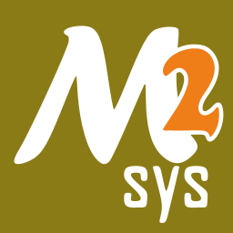

# Compiling on Windows

This guide seeks to set out how to compile the firmware on Windows and the supported
(but not only) way to build BMDA for Windows.

## Building the firmware on a Windows machine

To build the firmware on Windows you will need the following minimum requirements:

* The [ARM GNU Toolchain](https://developer.arm.com/downloads/-/arm-gnu-toolchain-downloads) compiler suite for bare metal
* A POSIX-compliant shell such as Bash
* Git for Windows if building from the repository instead of a release

The easiest way to get  to a working setup is to use:

* [MSYS2](https://www.msys2.org/) and follow the installation guide
* [ARM GNU Toolchain release 12.2.Rel1](https://developer.arm.com/-/media/Files/downloads/gnu/12.2.rel1/binrel/arm-gnu-toolchain-12.2.rel1-mingw-w64-i686-arm-none-eabi.zip?rev=709f3f15b2ee4763b186c10153ee6ca9&hash=8C0761A17A1E4861B96DDB604C177F5B)

### Setting up the build environment

Having installed MSYS2 and with the toolchain Zip file downloaded to the Downloads directory in your user profile area,
you will need to open the MSYS2 UCRT64 prompt from the start menu.
That is the prompt item with this icon: 

Inside the MSYS2 environment run the following to update the environment and follow all prompts provided:

```bash
pacman -Syu
pacman -S pacboy git unzip
pacboy -S python:p make:p
unzip $USERPROFILE/Downloads/arm-gnu-toolchain-12.2.rel1-mingw-w64-i686-arm-none-eabi.zip -d .
export PATH=$HOME/arm-gnu-toolchain-12.2.rel1-mingw-w64-i686-arm-none-eabi/bin:$PATH
```

At this point you will have the tools required to build the firwmare and they will all be available from the shell.
It is important that all further steps be performed in this same shell, or if you do open a new one, that you
run the final line of this setup on each new shell you use.

### Acquiring the source
