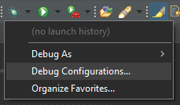
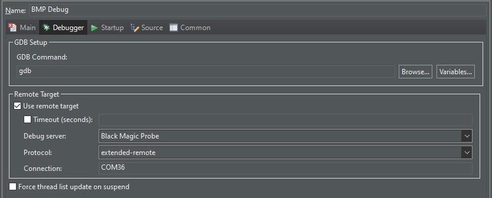

# STM32CubeIDE

[STM32CubeIDE](https://www.st.com/en/development-tools/stm32cubeide.html) is an Eclipse-based IDE supplied with STM32 microcontrollers by STMicro.

BlackMagicProbe support for it is now built-in at the time of writing these lines (v1.16.0).

## Debug configuration

A GDB debug configuration has to be created in order to debug the target device.

Head to the ``Debug Configurations`` menu.



Create a new ``GDB Hardware Debugging`` configuration.

In the ``Debugger`` tab, select the ``Black Magic Probe`` option as the debug server.



If you installed ``arm-none-eabi-gdb`` previously, change the default ``GDB Command`` to ``arm-none-eabi-gdb`` from ``gdb``.

In the ``Startup`` tab, enter the following information for the ``Initialization Commands``:

```
set logging on
set mem inaccessible-by-default off
monitor connect_rst enable
monitor auto_scan
attach 1
monitor erase_mass
```

The configuration should now work to debug the target STM32.

## Run configuration

STM32CubeIDE doesn't support hardware GDB run configurations.

In order to support it, duplicate the ``BMP Debug`` configuration into ``BMP Run``.

In the ``Startup`` tab, enter the following information for the ``Run Commands``:

```
detach 1
quit
```

Running this configuration will start the program on the target, then let it run and quit debugging.

You should now be all set up for debugging and running your code on a STM32 target with STM32CubeIDE and a BlackMagicProbe!
